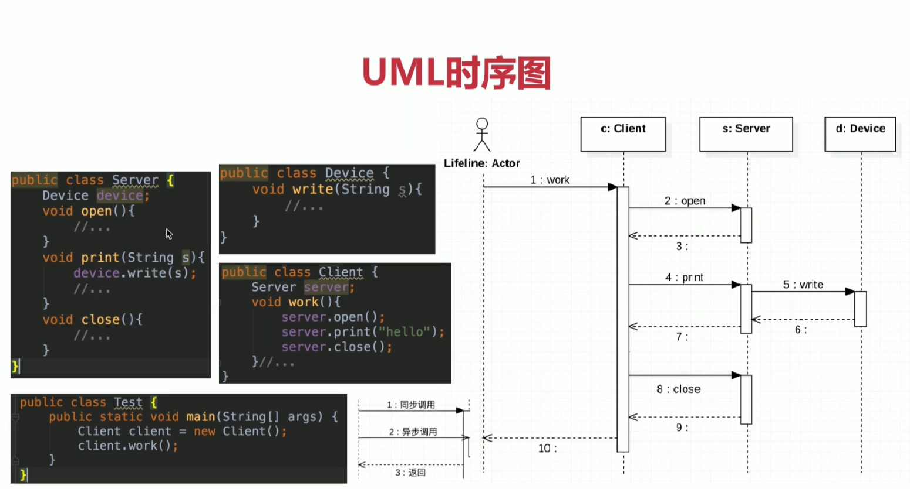
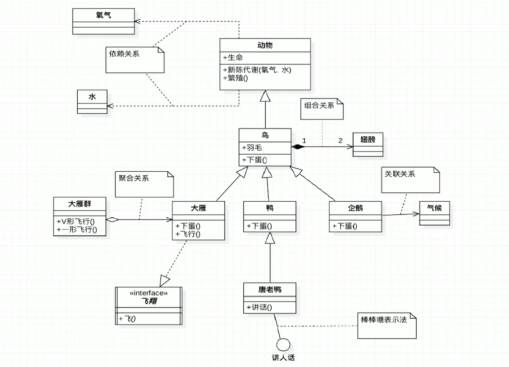

# UML

## uml定义
- 统一建模语言
- 非专利的第三代建模和规约语言

## UML特点
- UML是一种开放的方法
- 用于说明、可视化、构建和编写一个正在开发的面向对象的、软件密集系统的制品的开放方法
- UML展现了一系列最佳工程实践
  这些最佳实践在对大规模，复杂系统进行建模方面，特别是在软件架构层次已经被验证有效

## UML2.2分类
- 结构式图形:强调的是系统式的建模
  - 静态图（类图，对象图，包图)
  - 实现图（组件图，部署图)
  - 剖面图
  - 复合结构图
- 行为式图形:强调系统模型中触发的事件
  - 活动图
  - 状态图
  - 用例图
- 交互式图形:属于行为式图形子集合，强调系统模型中资料流程
  - 通信图
  - 交互概述图(UML2.0 )
  - 时序图(UML2.0 )
  - 时间图(UML2.0 )

### UML类图
- Class Diagram:用于表示类、接口、实例等之间相互的静态关系
- 虽然名字叫类图，但类图中并不只有类

#### 记忆技巧
- UML箭头方向∶从子类指向父类
- 提示∶可能会认为子类是以父类为基础的，箭头应从父类指向子类

#### 记忆技巧-箭头方向
- 定义子类时需要通过extends关键字指定父类
- 子类一定是知道父类定义的，但父类并不知道子类的定义
- 只有知道对方信息时才能指向对方
- 所以箭头方向是从子类指向父类

#### 记忆技巧-实线-继承|虚线-实现

- 空心三角箭头:继承或实现
- 实线-继承，is a关系，扩展目的，不虚，很结实
- 虚线-实现，虚线代表”虚”无实体

####  记忆技巧-实线-关联|虚线-依赖
- 虚线-依赖关系:临时用一下，若即若离，虚无缥缈，若有若无
- 表示一种使用关系，一个类需要借助另一个类来实现功能
- 一般是一个类使用另一个类做为参数使用，或作为返回值

- 关联关系∶关系稳定，实打实的关系，铁哥们
- 一个类对象和另一个类对象有关联
- 是一个类中有另一个类对象做为属性

#### 记忆技巧-空心菱形-聚合|实心菱形-组合
- 就是一个盛东西的器皿（例如盘子)
- :代表空器皿里可以放很多相同东西，聚在一起（箭头方向所指的类
- 组合:代表满器皿里已经有实体结构的存在，生死与共

#### 记忆技巧-空心菱形-聚合
- 整体和局部的关系，两者有着独立的生命周期，是has a的关系
- 弱关系
- 消极的词∶弱-空
#### 记忆技巧-实心菱形-组合
- 整体与局部的关系，和聚合的关系相比，关系更加强烈两者有相同的生命周期，contains-a的关系
- 强关系
- 积极的词∶强-满

- 常见数字表达及含义，假设有A类和B类，数字标记在A类侧
  - 0..1: 0或1个实例.
  - 0..*: 0或多个实例.
  - 1..1: 1个实例.
  - 1 只能有一个实例.
  - 1..*: 至少有一个实例.

### UML时序图
- Sequence Diagram:是显示对象之间交互的图，这些对象是按时间
顺序排列的。
- 时序图中包括的建模元素主要有∶
  
  >对象(Actor )、生命线(Lifeline ) .控制焦点(Focus of control )、消息(Message )等

## UML类图

